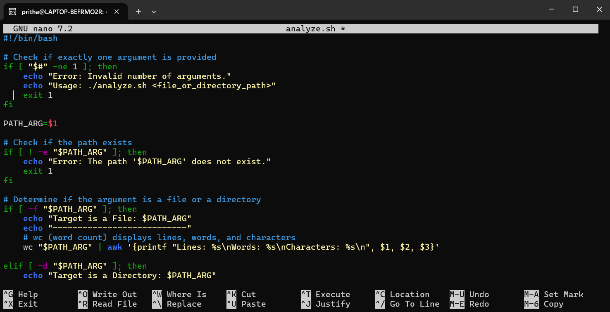

## **Command Line Interface Graded Lab Assignment 2, submitted by Pritha Aggarwal**

Linux Commands testing assignment  
Personal Ubuntu Used-

### **Question1**  
Create a shell script named analyze.sh that accepts exactly ONE command-line argument.
• If the argument is a file: – Display the number of lines, words, and characters in the file.
• If the argument is a directory: – Display the total number of files present. – Display the number of .txt files in the directory.
• If the argument count is invalid or the path does not exist: – Display an appropriate error message. 

**Command**:
```bash
#!/bin/bash

# Check if exactly one argument is provided
if [ "$#" -ne 1 ]; then
    echo "Error: Invalid number of arguments."
    echo "Usage: ./analyze.sh <file_or_directory_path>"
    exit 1
fi

PATH_ARG=$1

# Check if the path exists
if [ ! -e "$PATH_ARG" ]; then
    echo "Error: The path '$PATH_ARG' does not exist."
    exit 1
fi

# Determine if the argument is a file or a directory
if [ -f "$PATH_ARG" ]; then
    echo "Target is a File: $PATH_ARG"
    echo "---------------------------"
    # wc (word count) displays lines, words, and characters
    wc "$PATH_ARG" | awk '{printf "Lines: %s\nWords: %s\nCharacters: %s\n", $1, $2, $3}'

elif [ -d "$PATH_ARG" ]; then
    echo "Target is a Directory: $PATH_ARG"
    echo "--------------------------------"
    
    # Count total files (excluding directories)
    TOTAL_FILES=$(find "$PATH_ARG" -maxdepth 1 -type f | wc -l)
    
    # Count .txt files
    TXT_FILES=$(find "$PATH_ARG" -maxdepth 1 -type f -name "*.txt" | wc -l)
    
    echo "Total files: $TOTAL_FILES"
    echo ".txt files:  $TXT_FILES"

else
    echo "Error: '$PATH_ARG' is neither a regular file nor a directory."
    exit 1
fi
```
**Output**:  
   

Explanation: **$#:** This variable tracks the number of arguments. If it's not equal (-ne) to 1, the script exits.

**[ -f "$PATH_ARG" ]:** This checks if the path is a regular file.

**wc & awk:** wc provides the raw counts; awk is used to format that output nicely into labeled lines.

**find ... -type f:** This specifically looks for files inside the directory, ensuring we don't accidentally count sub-directories as "files."


