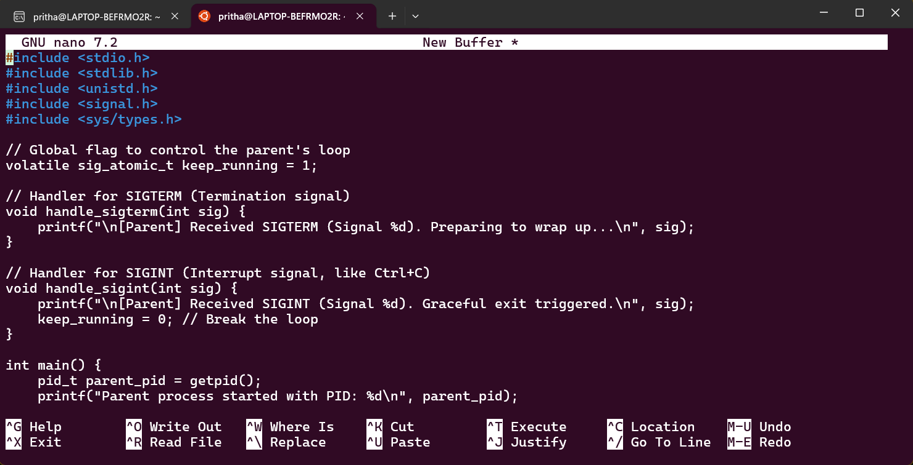

## **Command Line Interface Graded Lab Assignment 2, submitted by Pritha Aggarwal**

Linux Commands testing assignment  
Personal Ubuntu Used-

### **Question10**  
Write a C program demonstrating signal handling.
• Parent process runs indefinitely
• Child process sends SIGTERM after 5 seconds
• Another child sends SIGINT after 10 seconds
• Parent handles each signal differently and exits gracefully

**Command**:
```bash
#include <stdio.h>
#include <stdlib.h>
#include <unistd.h>
#include <signal.h>
#include <sys/types.h>

// Global flag to control the parent's loop
volatile sig_atomic_t keep_running = 1;

// Handler for SIGTERM (Termination signal)
void handle_sigterm(int sig) {
    printf("\n[Parent] Received SIGTERM (Signal %d). Preparing to wrap up...\n", sig);
}

// Handler for SIGINT (Interrupt signal, like Ctrl+C)
void handle_sigint(int sig) {
    printf("\n[Parent] Received SIGINT (Signal %d). Graceful exit triggered.\n", sig);
    keep_running = 0; // Break the loop
}

int main() {
    pid_t parent_pid = getpid();
    printf("Parent process started with PID: %d\n", parent_pid);

    // Register signal handlers
    signal(SIGTERM, handle_sigterm);
    signal(SIGINT, handle_sigint);

    // 1. First Child: Sends SIGTERM after 5 seconds
    if (fork() == 0) {
        sleep(5);
        printf("[Child 1] Sending SIGTERM to parent...\n");
        kill(parent_pid, SIGTERM);
        exit(0);
    }

    // 2. Second Child: Sends SIGINT after 10 seconds
    if (fork() == 0) {
        sleep(10);
        printf("[Child 2] Sending SIGINT to parent...\n");
        kill(parent_pid, SIGINT);
        exit(0);
    }

    // 3. Parent: Runs "indefinitely" until keep_running is false
    printf("[Parent] Waiting for signals...\n");
    while (keep_running) {
        printf("... parent is working ...\n");
        sleep(2);
    }

    printf("[Parent] All signals handled. Goodbye!\n");
    return 0;
}
```
**Output**:  
   

Explanation: **signal(SIGNAL_NAME, handler_function):** This tells the OS, "When this specific signal arrives, don't do the default action (which is usually crashing); run my function instead."

**kill(target_pid, SIGNAL_NAME):** Despite the scary name, kill is simply the command used to send a signal to a specific process.

**sig_atomic_t:** This is a special variable type used for flags in signal handlers. It ensures that the variable is read or written in a single "atomic" step, preventing errors if a signal arrives exactly while the variable is being accessed.
