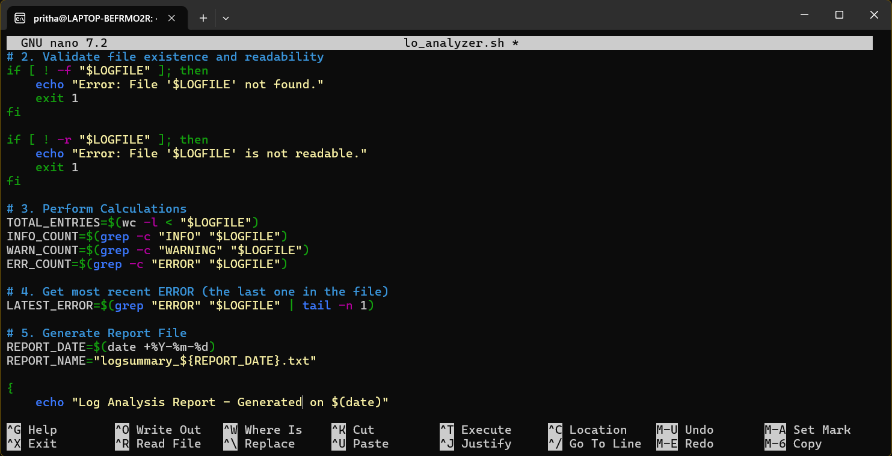

## **Command Line Interface Graded Lab Assignment 2, submitted by Pritha Aggarwal**

Linux Commands testing assignment  
Personal Ubuntu Used-

### **Question2**  
You are given a log file containing entries in the format:

YYYY-MM-DD HH:MM:SS LEVEL MESSAGE

Example:

2025-01-12 10:15:22 INFO System started

2025-01-12 10:16:01 ERROR Disk not found

2025-01-12 10:16:45 WARNING High memory usage

2025-01-12 10:17:10 ERROR Network timeout

Requirements:

1. The script must accept the log file name as a command-line argument.

2. Validate that the file exists and is readable.

3. Count and display:

  - Total number of log entries

  - Number of INFO, WARNING, and ERROR messages

4. Display the most recent ERROR message.

5. Generate a report file named logsummary_<date>.txt.

6. Handle errors gracefully with meaningful messages.

**Command**:
```bash
#!/bin/bash

# 1. Check if an argument was provided
if [ "$#" -ne 1 ]; then
    echo "Usage: $0 <log_file>"
    exit 1
fi

LOGFILE=$1

# 2. Validate file existence and readability
if [ ! -f "$LOGFILE" ]; then
    echo "Error: File '$LOGFILE' not found."
    exit 1
fi

if [ ! -r "$LOGFILE" ]; then
    echo "Error: File '$LOGFILE' is not readable."
    exit 1
fi

# 3. Perform Calculations
TOTAL_ENTRIES=$(wc -l < "$LOGFILE")
INFO_COUNT=$(grep -c "INFO" "$LOGFILE")
WARN_COUNT=$(grep -c "WARNING" "$LOGFILE")
ERR_COUNT=$(grep -c "ERROR" "$LOGFILE")

# 4. Get most recent ERROR (the last one in the file)
LATEST_ERROR=$(grep "ERROR" "$LOGFILE" | tail -n 1)

# 5. Generate Report File
REPORT_DATE=$(date +%Y-%m-%d)
REPORT_NAME="logsummary_${REPORT_DATE}.txt"

{
    echo "Log Analysis Report - Generated on $(date)"
    echo "------------------------------------------"
    echo "Total Entries:    $TOTAL_ENTRIES"
    echo "INFO Messages:    $INFO_COUNT"
    echo "WARNING Messages: $WARN_COUNT"
    echo "ERROR Messages:   $ERR_COUNT"
    echo "------------------------------------------"
    if [ -n "$LATEST_ERROR" ]; then
        echo "Most Recent Error: $LATEST_ERROR"
    else
        echo "Most Recent Error: None found."
    fi
} > "$REPORT_NAME"

# 6. Display to terminal
cat "$REPORT_NAME"
echo -e "\nReport saved to: $REPORT_NAME"
```
**Output**:  
   

Explanation: **grep -c:** The c stands for "count." Instead of showing the lines, it just tells how many times it found the word (like "ERROR").

**tail -n 1:** This looks at the very bottom of the file (the "tail"). Since log files are chronological, the last error in the file is the most recent one.

**{ ... } > file.txt:** This is a "block redirection." Everything inside the curly braces is bundled up and saved into the report file all at once.

**date +%Y-%m-%d:** This formats the current date into the specific string needed for your filename.

