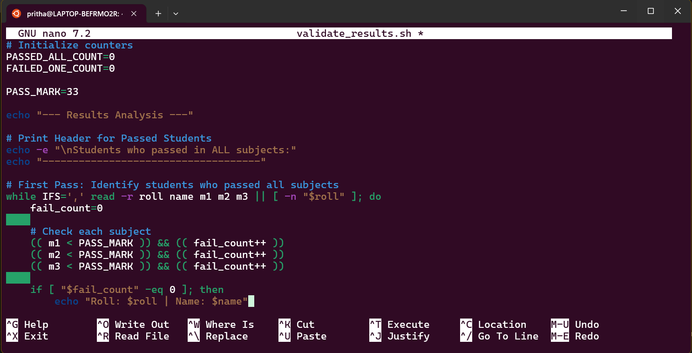

## **Command Line Interface Graded Lab Assignment 2, submitted by Pritha Aggarwal**

Linux Commands testing assignment  
Personal Ubuntu Used-

### **Question3**  
Write a shell script validate_results.sh that reads student data from marks.txt.Each line contains:RollNo, Name, Marks1,Marks2,Marks3Your script should:
• Print students who failed in exactly ONE subject
• Print students who passed in ALL subjects
• Print the count of students in each categoryPassing marks for each subject is 33.Use loops, conditionals, and arithmetic operations.

**Command**:
```bash
#!/bin/bash

# Check if file exists
FILE="marks.txt"
if [ ! -f "$FILE" ]; then
    echo "Error: $FILE not found."
    exit 1
fi

# Initialize counters
PASSED_ALL_COUNT=0
FAILED_ONE_COUNT=0

PASS_MARK=33

echo "--- Results Analysis ---"

# Print Header for Passed Students
echo -e "\nStudents who passed in ALL subjects:"
echo "------------------------------------"

# First Pass: Identify students who passed all subjects
while IFS=',' read -r roll name m1 m2 m3 || [ -n "$roll" ]; do
    fail_count=0
    
    # Check each subject
    (( m1 < PASS_MARK )) && (( fail_count++ ))
    (( m2 < PASS_MARK )) && (( fail_count++ ))
    (( m3 < PASS_MARK )) && (( fail_count++ ))
    
    if [ "$fail_count" -eq 0 ]; then
        echo "Roll: $roll | Name: $name"
        (( PASSED_ALL_COUNT++ ))
    fi
done < "$FILE"

# Second Pass: Identify students who failed exactly one subject
echo -e "\nStudents who failed in exactly ONE subject:"
echo "-------------------------------------------"

while IFS=',' read -r roll name m1 m2 m3 || [ -n "$roll" ]; do
    fail_count=0
    
    (( m1 < PASS_MARK )) && (( fail_count++ ))
    (( m2 < PASS_MARK )) && (( fail_count++ ))
    (( m3 < PASS_MARK )) && (( fail_count++ ))
    
    if [ "$fail_count" -eq 1 ]; then
        echo "Roll: $roll | Name: $name"
        (( FAILED_ONE_COUNT++ ))
    fi
done < "$FILE"

# Print Summary
echo -e "\n--- Summary Report ---"
echo "Passed All Subjects: $PASSED_ALL_COUNT"
echo "Failed One Subject:  $FAILED_ONE_COUNT"
```
**Output**:  
   

Explanation: **IFS=',':** This stands for Internal Field Separator. It tells the script to split each line at the commas so that roll, name, m1, m2, and m3 are assigned to their own variables.

**(( ... )):** This is how we do Arithmetic Evaluation in Bash. It allows for clean comparisons like m1 < PASS_MARK.

**fail_count++:** This increments our counter every time a student's mark is below 33.

**|| [ -n "$roll" ]:** This is a common Bash trick. It ensures the script processes the very last line of the file even if that line doesn't end with a newline character.

