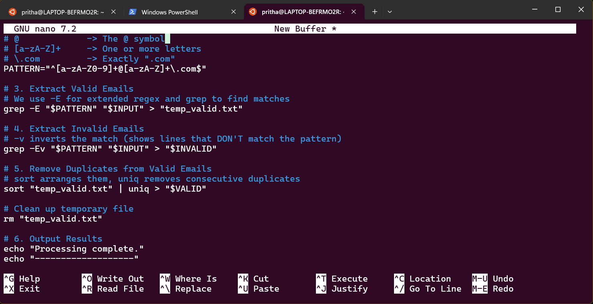

## **Command Line Interface Graded Lab Assignment 2, submitted by Pritha Aggarwal**

Linux Commands testing assignment  
Personal Ubuntu Used-

### **Question4**  
Create a shell script emailcleaner.sh that processes emails.txt.
• Extract all valid email addresses and store them in valid.txt
• Extract invalid email addresses and store them in invalid.txt
• Remove duplicate entries from valid.txtValid email format:<letters_and_digits>@<letters>.comUse grep, sort, uniq, and redirection.

**Command**:
```bash
#!/bin/bash

INPUT="emails.txt"
VALID="valid.txt"
INVALID="invalid.txt"

# 1. Check if the input file exists
if [ ! -f "$INPUT" ]; then
    echo "Error: $INPUT not found!"
    exit 1
fi

# 2. Define the Regex pattern
# [a-zA-Z0-9]+  -> One or more letters or digits
# @             -> The @ symbol
# [a-zA-Z]+     -> One or more letters
# \.com         -> Exactly ".com"
PATTERN="^[a-zA-Z0-9]+@[a-zA-Z]+\.com$"

# 3. Extract Valid Emails
# We use -E for extended regex and grep to find matches
grep -E "$PATTERN" "$INPUT" > "temp_valid.txt"

# 4. Extract Invalid Emails
# -v inverts the match (shows lines that DON'T match the pattern)
grep -Ev "$PATTERN" "$INPUT" > "$INVALID"

# 5. Remove Duplicates from Valid Emails
# sort arranges them, uniq removes consecutive duplicates
sort "temp_valid.txt" | uniq > "$VALID"

# Clean up temporary file
rm "temp_valid.txt"

# 6. Output Results
echo "Processing complete."
echo "-------------------"
echo "Valid unique emails: $(wc -l < $VALID)"
echo "Invalid entries:     $(wc -l < $INVALID)"
```
**Output**:  
   

Explanation: **grep -E:** Enables Extended Regular Expressions, which allows us to use symbols like + (meaning "one or more").

The Pattern ^[a-zA-Z0-9]+@[a-zA-Z]+\.com$:

^ and $ ensure the pattern matches the entire line, not just a piece of it.

\. is used because a plain . in Regex means "any character." The backslash "escapes" it so it specifically looks for a literal dot.

**grep -v:** This is a powerful flag that tells the script: "Give me everything that doesn't look like a valid email."

**sort | uniq:** uniq only removes duplicates that are right next to each other. By sorting the list first, we ensure all identical emails are grouped together so uniq can catch them.

