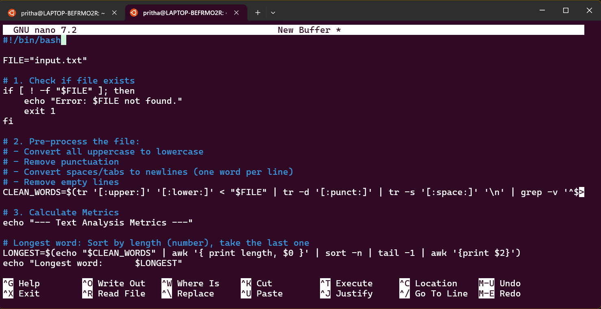

## **Command Line Interface Graded Lab Assignment 2, submitted by Pritha Aggarwal**

Linux Commands testing assignment  
Personal Ubuntu Used-

### **Question6**  
Create a shell script metrics.sh that analyzes a text file input.txt.The script should display:
• Longest word
• Shortest word
• Average word length
• Total number of unique wordsUse pipes and commands such as tr, sort, uniq, wc.

**Command**:
```bash
#!/bin/bash

FILE="input.txt"

# 1. Check if file exists
if [ ! -f "$FILE" ]; then
    echo "Error: $FILE not found."
    exit 1
fi

# 2. Pre-process the file: 
# - Convert all uppercase to lowercase
# - Remove punctuation
# - Convert spaces/tabs to newlines (one word per line)
# - Remove empty lines
CLEAN_WORDS=$(tr '[:upper:]' '[:lower:]' < "$FILE" | tr -d '[:punct:]' | tr -s '[:space:]' '\n' | grep -v '^$')

# 3. Calculate Metrics
echo "--- Text Analysis Metrics ---"

# Longest word: Sort by length (number), take the last one
LONGEST=$(echo "$CLEAN_WORDS" | awk '{ print length, $0 }' | sort -n | tail -1 | awk '{print $2}')
echo "Longest word:      $LONGEST"

# Shortest word: Sort by length (number), take the first one
SHORTEST=$(echo "$CLEAN_WORDS" | awk '{ print length, $0 }' | sort -n | head -1 | awk '{print $2}')
echo "Shortest word:     $SHORTEST"

# Average word length: Sum of lengths divided by count
AVG_LENGTH=$(echo "$CLEAN_WORDS" | awk '{ sum += length($0); n++ } END { if (n > 0) print sum / n; else print 0 }')
echo "Avg word length:   $AVG_LENGTH"

# Total unique words: Sort them and run through uniq
UNIQUE_COUNT=$(echo "$CLEAN_WORDS" | sort | uniq | wc -l)
echo "Unique word count: $UNIQUE_COUNT"
```
**Output**:  
   

Explanation: **tr '[:upper:]' '[:lower:]':** Makes the analysis case-insensitive (so "The" and "the" are treated as the same word).

**tr -d '[:punct:]':** Deletes commas, periods, and exclamation points so they don't count as part of the word length.

**tr -s '[:space:]' '\n':** This is the most important part. It replaces every space with a "newline," effectively turning a horizontal sentence into a vertical list of words.

**awk '{ print length, $0 }':** This creates two columns: the first column is the number of letters, the second is the word itself. This makes sorting by size possible.
