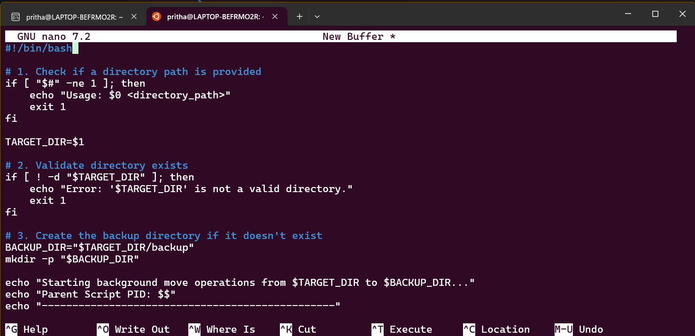

## **Command Line Interface Graded Lab Assignment 2, submitted by Pritha Aggarwal**

Linux Commands testing assignment  
Personal Ubuntu Used-

### **Question8**  
Create a shell script bg_move.sh that accepts a directory path.
• Move each file in the directory into a subdirectory named backup/
• Perform each move operation in the background
• Display the PID of each background process
• Wait for all background processes to finishUse &, wait, $$, and $! variables.  

**Command**:
```bash
#!/bin/bash

# 1. Check if a directory path is provided
if [ "$#" -ne 1 ]; then
    echo "Usage: $0 <directory_path>"
    exit 1
fi

TARGET_DIR=$1

# 2. Validate directory exists
if [ ! -d "$TARGET_DIR" ]; then
    echo "Error: '$TARGET_DIR' is not a valid directory."
    exit 1
fi

# 3. Create the backup directory if it doesn't exist
BACKUP_DIR="$TARGET_DIR/backup"
mkdir -p "$BACKUP_DIR"

echo "Starting background move operations from $TARGET_DIR to $BACKUP_DIR..."
echo "Parent Script PID: $$"
echo "------------------------------------------------"

# 4. Loop through files and move them to background
# We use find to avoid moving the 'backup' directory into itself
find "$TARGET_DIR" -maxdepth 1 -type f | while read -r FILE; do
    # Perform the move in the background
    mv "$FILE" "$BACKUP_DIR/" &
    
    # Capture and display the PID of the last background process
    MOVE_PID=$!
    echo "Moving $(basename "$FILE") [PID: $MOVE_PID]"
done

# 5. Wait for all background processes to complete
echo "------------------------------------------------"
echo "Waiting for all background tasks to finish..."
wait

echo "Success: All files have been moved to $BACKUP_DIR."
```
**Output**:  
   

Explanation: $$	The Process ID (PID) of the script itself while it is running.

&	Placed at the end of a command to run it in the background.

$!	The PID of the most recent background process.

wait	A command that pauses the script until every background job started by the script has finished.
